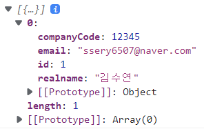

# .map is not a function

서버에서 fetch해온 response.data를 .map 함수를 통해 하나씩 살피려는 작업 중, "Uncaught TypeError: users.map is not a function" 오류가 발생.

<br />

## 1. 문제 상황 및 출처

```
...
//선언부
  const [post, setPost] = useState("");
  const [users, setUsers] = useState("");
...
//컴포넌트 return 부분
    <div>
        {users.map((user) => {
          if (user.id === post.writer) {
            return user.realname;
          }
        })}
    </div>
...
```

users.map()을 사용한 곳은 컴포넌트 return 부분인 jsx 내부입니다. fetch(get)해온 response.data를, setUsers를 통해 users로 설정했습니다. users의 객체 key를 이용한 작업을 하는 도중 오류가 발생했습니다. console.log(users) 코드를 입력해도 콘솔에는 아무 출력도 되지 않습니다.

<br>

## 2. 발생 조건

아래는 문제가 해결되기 전 axios를 사용하여 서버에 get 요청을 보내고 response를 받은 코드입니다.

```
  useEffect(() => {
    axios
      .get(`urls`)
      .then((resp) => setUsers(resp.data))
      .catch((Error) => {
        console.log(Error);
      });
  }, []);
```

위 코드의 setUsers를 console.log로 변경하여 response.data를 콘솔에 출력해봅니다.

위 출력 결과에 따르면 users는 객체를 요소로 가지고 있는 배열입니다. 인터넷에 검색하여 나오는 결과 중 대부분은 오브젝트 안의 배열에 map을 사용해 발생한 오류인데, 제가 작성한 코드는 적어도 그런 경우가 아닌 것 같았습니다. 따라서 state의 초깃값 혹은 state를 적용할 때 문제가 있거나 jsx 내부 표기 방법이 잘못되었을 것이라고 생각했습니다.

<br>

## 3. 원인 및 해결

```
//잘못된 사용
  const [users, setUsers] = useState("");

//해결된 코드
  const [users, setUsers] = useState([]);
```

'배열'에 집중해서 이것저것 시도하던 중, useState의 초깃값을 문자열로 지정했기 때문에 response가 배열로 이루어지지 않았다는 것을 알았습니다.
실수라면 실수지만... 별 신경도 쓰지 않고 이렇게 작성해도 되겠다 생각했던 부분이라 확실히 짚고 넘어가야 할 것 같습니다.

<b>useState의 인자로 ''는 문자열, true/false는 불리언, 0은 숫자, []는 배열을 사용하기 위해 지정합니다.</b> 수정 결과 콘솔 출력과 웹페이지 출력이 잘 이루어졌습니다.



<br>
