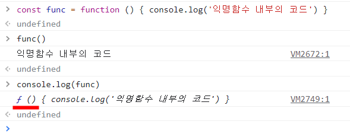
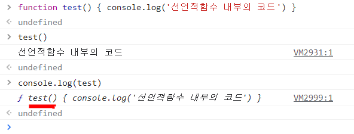

# 익명 함수(Anonymous function) vs 선언적 함수(Native function)

익명함수와 선언적함수는 둘 다 함수이고 자신이 원하는 기능으로 만들 수 있다는 점에서 비슷합니다. 그러면 평소 c/c++, python에서 하던 것처럼 선언적함수만 사용해도 괜찮지 않을까요?

물론 괜찮지만 익명함수를 사용하는 이유는 따로 있습니다. 두 함수의 사용 방법과 차이점에 대해 정리해보았습니다.

## <br />

## 1. 익명 함수(Anonymous function)

이름이 붙어있지 않은 함수.

```
function () { }
```

#### 1-1. 익명 함수의 선언

아래처럼 익명함수를 선언하고 실행할 수 있습니다.



함수의 이름이 나타나지 않고 'f ( )'로만 표시되었습니다. 말 그대로 이름이 붙어있지 않은 함수죠!

#### 1-2. 익명 함수의 사용

익명함수는 위 콘솔의 코드처럼 불러와서 쓸 수도 있지만 보통은 아래처럼 메소드 안에, 혹은 함수 안에 다른 함수를 불러올 때 사용합니다.

아래 코드는 콜백함수를 예시로 든 것입니다.

```
    <script>
        //3번 불러오는 콜백함수
        function callThreeTimes(callback) {
            for(let i=0 ; i<3 ; i++){
                callback(i)
            }
        }
        //콜백함수 callThreeTimes의 안에 단발적 사용이 가능한 익명함수를 매개변수로 넣었다.
        callThreeTimes(function (str){
            console.log(`${str}번째 반복입니다.`) //콜백함수의 안에서 3번 출력한다.
        })
    </script>
```

'callThreeTimes(function(str){})'에서 익명함수가 쓰였습니다.
익명함수는 이처럼 따로 선언하지 않고 주로 _함수/메소드 안에서 만들어져 즉시호출되는 식으로 사용됩니다._

<br />

## 2. 선언적 함수(Native function)

함수 이름 지정 후 원할 때 불러오는 식으로 사용하는 함수.

```
function 함수이름() {  }
```

#### 2-1. 선언적 함수의 선언


위에서의 익명함수와는 다르게 함수 이름이 같이 출력된 것을 볼 수 있습니다. 물론 선언적 함수도 콜백함수/메소드 안에서 사용이 가능합니다.

그렇다면 굳이 익명함수를 사용하는 이유가 무엇일까요?
<br/>

## 3. 익명 함수(Anonymous function) vs 선언적 함수(Native function)

결론부터 말하자면, 익명함수가 더 안전합니다.

코드는 맨 위부터 순차적으로 실행되나, 선언적함수는 코드가 순차실행되기 전에 생성됩니다. 함수가 코드의 맨 아랫부분에서 선언되더라도 말입니다.(자바스크립트는 함수를 아무데서나 선언 가능)

반면 익명함수는 코드의 순서에 따라 순차실행됩니다. 문제는 익명함수와 선언적함수가 동시에 사용될 때, 그리고 동시에 그 두 함수의 이름이 같을 때 발생합니다.

```
    <script>
        //익명함수
        func = function() {
            console.log('익명함수입니다.')
        }
        //선언적함수
        function func() {
            console.log('선언적 함수입니다.')
        }
        func() //함수호출
    </script>
```

함수의 이름이 같을 경우 더 늦게 실행되는 함수가 먼저 만들어진 함수를 덮어씁니다. 위 코드의 실행 결과는 아래와 같습니다.


정리하자면... 선언적함수는 코드 순차실행 전에 미리 생성되고, 익명함수는 순차실행되므로 선언적함수를 익명함수가 덮어씁니다.

이러한 위험 때문에 익명함수가 더 안전하며 익명함수를 선호하는 경우가 더 많습니다.

## Reference

- JavaScript Tutorial : https://www.javascripttutorial.net/javascript-anonymous-functions/
- 혼자 공부하는 자바스크립트, 윤인성
