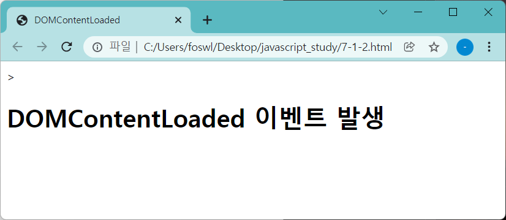

# DOMContentLoaded

웹 브라우저가 문서 객체를 모두 읽고 나서 실행하는 이벤트입니다. (비슷한 이벤트인 load는 웹 브라우저가 DOM Tree 외의 모든 자원을 다 받아 렌더링이 전부 끝난 시점에 발생)

<br />

## 1. DOMContentLoaded를 사용하는 이유

head 태그에서 코드를 작성하는 상황입니다. body 태그에서 무언가를 출력하기 위해 document.body.innerHTML을 사용한다고 해보겠습니다.

HTML은 위에서부터 아래로 코드를 읽고, head 태그는 body 태그보다 위에 있습니다. 따라서 아직 읽지도 않은 body태그에 접근했으므로 문제가 발생합니다.

그런데 이 이벤트를 사용하면 어차피 문서객체를 전부 읽었기 때문에 head태그에서도 body태그에 문제 없이 접근 가능합니다..!

DOMContentLoaded는 위 상황처럼, DOM 로딩이 다 되지 않았을 때 DOM을 조작하는 js 코드가 실행되는 경우를 막기 위해 사용합니다.

<br>

## 2. DOMContentLoaded 사용해보기

```
document.addEventListener('DOMContentLoaded', ()=>{})
```

보통 addEventListener 안에서 사용합니다. 1에서 설명한 이유와 같은 시나리오의 예시를 들어보겠습니다.

```
<!DOCTYPE html>
<html>
<head>
    <title>DOMContentLoaded</title>
    <script>
        document.addEventListener('DOMContentLoaded', () => {
            const h1 = (text) => `<h1>${text}</h1>`
            document.body.innerHTML += h1('DOMContentLoaded 이벤트 발생')
        })
    </script>
</head>
<body>
</body>
</html>>
```

script를 head안에서 작성하고, document.body.innerHTML을 사용하였는데도 오류 없이 아래처럼 출력됩니다.



※ 예시일 뿐이지만 Javascript 코드는 body 태그에 작성하는 것이 성능상 더 좋습니다.

<br>

## Reference

- boostcourse web programming
- 혼자 공부하는 자바스크립트, 윤인성
