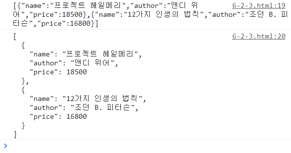
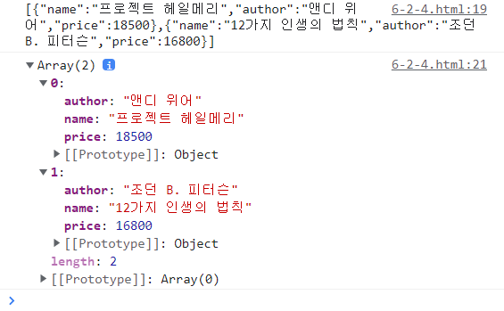

# JSON Methods

JSON : JavaScript Object Notation.
네트워크를 통해 각각의 프로그래밍 언어로 만든 애플리케이션들이 데이터를 저장, 교환할 때 사용됩니다.

<b>JSON 규칙</b>

- 값의 표현은 문자열, 숫자, 불 자료형만 가능하다. (함수 불가능)
- 문자열은 반드시 큰따옴표로 만든다.
- 키에도 반드시 따옴표를 붙인다.

```
{
   "First_Name" :  "value";
   "Last_Name": "value ";
}
```

JSON의 메소드로는 두 가지가 있습니다.

| Method           | 설명                           |
| ---------------- | ------------------------------ |
| JSON.stringify() | Javascript 객체 -> JSON 문자열 |
| JSON.parse()     | JSON 문자열 -> Javascript 객체 |

<br>

## 1. JSON.stringify()

JS 객체 -> JSON 문자열 변환 시 사용

```
JSON.stringify(data) //한 줄 출력
JSON.stringify(data, null, 2) //들여쓰기 활용해 여러 줄 출력
```

stringify에 인자를 하나만 넣으면 결과가 한 줄로 출력됩니다.
두 번째 인자는 객체에서 어떤 속성만 선택해 추출할 때 사용하는데, 보통 사용하지 않아 null을 넣습니다. 2는 들여쓰기를 두 칸 한다는 뜻입니다.

들여쓰기를 사용하여 입력하면 우리가 익숙한 객체 모양으로 출력됩니다.

```
    <script>
        const data = [{
            name: '프로젝트 헤일메리',
            author: '앤디 위어',
            price: 18500
        }, {
            name: '12가지 인생의 법칙',
            author: '조던 B. 피터슨',
            price: 16800
        }]

        //자료를 JSON으로 변환하기
        console.log(JSON.stringify(data))
        console.log(JSON.stringify(data, null, 2))
    </script>
```



<br>

## 2. JSON.parse()

JSON문자열 -> js객체로 전개.

```
JSON.parse(json)
```

인자로 JSON 문자열을 넣습니다.

```
    <script>
        const data = [{
            name: '프로젝트 헤일메리',
            author: '앤디 위어',
            price: 18500
        }, {
            name: '12가지 인생의 법칙',
            author: '조던 B. 피터슨',
            price: 16800
        }]
        //자료를 JSON으로 변환하기
        const json = JSON.stringify(data)
        console.log(json)
        //자료를 다시 js객체로 변환하기
        console.log(JSON.parse(json))
    </script>
```



stringify로 JSON 문자열화 시킨 뒤 parse를 이용해 다시 객체로 바꾸었습니다. 위 출력값이 stringify, 아래 출력값이 parse입니다.

<br>

## Reference

- java T point(javascript JSON) : https://www.javatpoint.com/javascript-json
- 혼자 공부하는 자바스크립트, 윤인성
