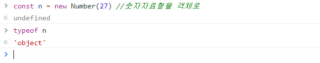
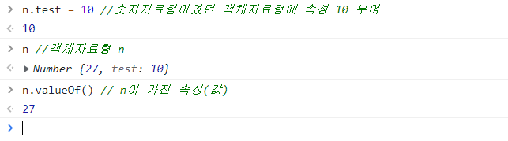
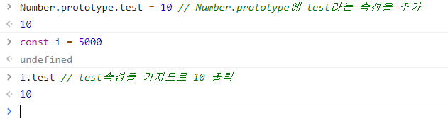
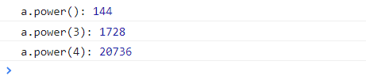
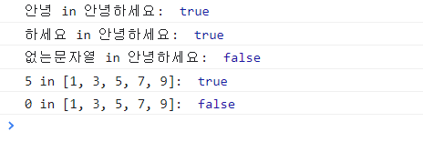

# 기본자료형(Prototype)

기본자료형을 객체자료형으로서 사용하는 방법을 정리합니다.

<br />

## 1. 기본자료형을 객체로 선언

> 기본자료형 : number, string, bool같이 실체가 있는 자료형(객체 제외)

기본자료형은 객체가 아니기 때문에 속성을 가질 수 없습니다. 하지만 js는 기본자료형을 객체로 선언하는 방법을 제공하고 있습니다.

```
const 객체 = new 자료형()

// 위 형식을 사용하여 만든 숫자, 문자열, 불 객체
const n = new Number(10)
const s = new String('안녕')
const b = new Boolean(true)
```

위 예시 중 n의 type을 콘솔에서 확인하면 'object'가 출력됩니다.



기본자료형이 객체자료형이 되면 속성을 부여하는 것이 가능합니다.  
콘솔에서 숫자 자료형을 객체자료형으로 바꾼 후 valueOf()을 이용해 속성을 확인해보았습니다.



<br>

## 2. Prototype으로 메소드 추가하기

prototype 객체에 속성, 메소드를 추가하면 기본 자료형(+모든 객체)이 해당 속성, 메소드를 사용할 수 있습니다.

```
자료형.prototype.메소드 = function () {  }
```

콘솔에서 Number.prototype에 test라는 속성을 추가해봅니다.



Number.prototype 객체에 test = 10 속성을 추가했습니다.
바로 아래 선언한 i=5000이지만, i는 Number 자료형이므로 test 속성을 가지고 있지요..! 따라서 i의 test속성은 10을 나타냅니다.

공부하며 ​이해를 돕기 위해 작성하였던 예제 코드를 아래에 정리합니다.

#### (ex1) 프로토타입을 활용해 숫자자료형에 제곱하는 메소드를 추가해보기

```
    <script>
        Number.prototype.power = function(n=2) {
            return this.valueOf() ** n
        }

        const a = 12

        console.log('a.power():', a.power())
        console.log('a.power(3):', a.power(3))
        console.log('a.power(4):', a.power(4))
    </script>
```

3번째 줄에 this.valueOf() ** n 을 풀어보면, Number.prototype 객체의 square 속성이 가진 '값'에(this.valueOf()) n제곱(**n)을 한다는 뜻입니다.

this\*\*n 이라고 써도 상관없지만 일반적으로는 valueOf()도 같이 사용한다고 합니다.



<br/>

#### 문자열 내부에 어떤 문자열이 포함되어 있는지 반환하는 메소드 추가해보기

```
    <script>
        String.prototype.contain = function (data) {
            return this.indexOf(data) >= 0
        }
        Array.prototype.contain = function (data) {
            return this.indexOf(data) >= 0
        }
        //String객체의 contain()메소드 사용하기
        const a = '안녕하세요'
        console.log('안녕 in 안녕하세요: ', a.contain('안녕'))
        console.log('하세요 in 안녕하세요: ', a.contain('하세요'))
        console.log('없는문자열 in 안녕하세요: ', a.contain('없는문자열'))

        //Array객체의 contain() 메소드 사용
        const b = [1, 3, 5, 7, 9]
        console.log('5 in [1, 3, 5, 7, 9]: ', b.contain(5))
        console.log('0 in [1, 3, 5, 7, 9]: ', b.contain(0))
    </script>

```

> indexOf(문자열) : js에서 전체 문자열(이하 A) 내부에 찾는 문자열(이하 B)이 있는지 확인할 때 사용. 문자열A 내부에 문자열B가 있으면, 문자열B가 시작되는 부분의 인덱스를 반환한다.(0 이상) 만약 없으면 -1을 반환한다. 배열에서도 사용 가능.

따라서 위 코드에서는 this.indexOf(data) >= 0 를 사용했습니다.



## Reference

- JavaScript Tutorial : https://www.javascripttutorial.net/javascript-prototype/
- 혼자 공부하는 자바스크립트, 윤인성
