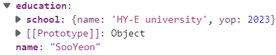
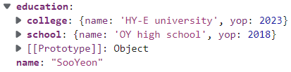

# lodash

배열, 객체, 숫자, 문자열 등을 보다 손쉽게 다룰 수 있게 해주는 라이브러리. 특히 배열, 객체, 문자열의 반복 / 값 조작 및 테스트 / 복합함수의 생성 등에 유용하다.

<br>

### Methods
- <a href="#find">_find / _.findIndex</a>
- <a href="#set">_.set</a>

<br>

## <p id="find">_.find / _.findIndex</p>

```
_.find(collection, 'key'/조건을 나타낼 표현식)
```
key에 해당하는 요소를 반환하거나,
표현식이 true인 경우의 요소를 찾아 반환한다. (요소가 객체인 경우 요소 전체 반환)

```
private videoContents = [
  { type: 'video', title: 'vue', date: '2022-08-01' },
  { type: 'video', title: 'react', date: '2022-07-31' },
  { type: 'video', title: 'jQuery', date: '2022-07-30' }
];

_.find(contents, (item) => item.title === 'vue')
// {type: 'video', title: 'vue', date: '2022-08-01'}

_.find(contents, {type: 'video', date: '2022-07-31'})
// {type: 'video', title: 'react', date: '2022-07-31'}

_.find(contents, ['title', 'jQuery'])
// {type: 'video', title: 'jQuery', date: '2022-07-30'}

_.find(contents, 'title')
// {type: 'video', title: 'vue', date: '2022-08-01'}
// 두 번째 자리에 key 값만 쓰면 그에 해당하는 맨 처음 요소만 출력된다.
```

_.findIndex는 요소의 인덱스를 반환한다. _.find와 동일한 형태로 사용한다.

```
private videoContents = [
  { type: 'video', title: 'vue', date: '2022-08-01' },
  { type: 'video', title: 'react', date: '2022-07-31' },
  { type: 'video', title: 'jQuery', date: '2022-07-30' }
];

_.findIndex(contents, (item) => item.title === 'vue')
// 0

_.findIndex(contents, {type: 'video', date: '2022-07-31'})
// 1

_.findIndex(contents, ['title', 'jQuery'])
// 2

_.findIndex(contents, 'title')
// 0
```

----


## <p id="set">_.set()</p>

객체 내부의 특정 경로에 값을 설정하는 데 사용된다.

```
_.set(object, path, value)
```

- object: 내부 값을 바꿀 객체
- path: value를 설정할 경로(key)
- value: 설정할 값

_.set 메소드는 주어진 객체(object)를 수정하고 수정된 객체를 반환한다.
두 가지 용도로 쓰일 수 있는데, 객체 내부의 값을 변경하거나 새로운 값을 생성할 때 사용할 수 있다.

1. 값 변경

```
  const object = {
    'name': 'SooYeon',
    'education': {
      'school': {
        'name': 'OY high school',
        'yop': 2018
      }
    }
  }
  const path = 'education.school'
  const collegeEducation = {
    'name': 'HY-E university',
    'yop': 2023
  }

  console.log(_.set(this.object, this.path, this.collegeEducation))
```


path는 객체 내부의 key를 의미한다. name값을 변경하려면 path를 'name'으로 설정하면 되고, 객체 내부의 객체의 경우에도 위처럼 'education.school' 같은 형태로 사용하면 된다.

2. 값 추가

```
  const object = {
    'name': 'SooYeon',
    'education': {
      'school': {
        'name': 'OY high school',
        'yop': 2018
      }
    }
  }
  const path = 'education.school'
  const collegeEducation = {
    'name': 'HY-E university',
    'yop': 2023
  }

  console.log(_.set(this.object, this.path, this.collegeEducation))
```


path에 새로운 key값을 입력하면 된다.

<br>

## Reference

- lodash: https://lodash.com/
- lodash document: https://lodash.com/docs/4.17.15

