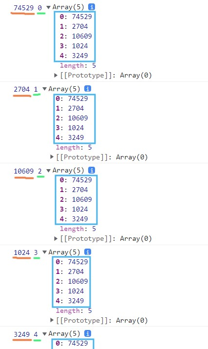
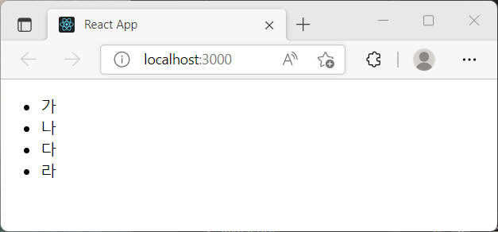

# 자바스크립트 배열 / React 컴포넌트의 map() 함수

map() 함수: 배열이 가진 함수로, 콜백함수에서 리턴한 값들로 새로운 배열을 만드는 메소드.

웹 애플리케이션을 만들 때 반복되는 코드를 작성하기 위해 유용하게 사용할 수 있습니다.

<br />

## 1. 형태

```
배열이름.map(function (value, index, array) {   })

//ES6 문법
//파라미터 생략이 가능하다.
배열이름.map((value, index, array) => )
```

콜백함수의 파라미터:

- value : 현재 처리하고 있는 요소
- index : 현재 처리하고 있는 요소의 index 값
- array : 현재 처리하고 있는 원본 배열

index와 array 파라미터 생략이 가능합니다.

<br>

## 2. map() 함수의 활용

map()을 이용해 데이터로 배열을 만들 수 있지만, React의 JSX 내에서 요소를 반복할 때에도 사용할 수 있습니다.

#### 2-1. 데이터 배열

배열 선언 후 map()함수를 적용합니다.

```
    <script>
        let numbers = [273, 52, 103, 32, 57]
        numbers = numbers.map((value)=>{
            return value * value // 배열 내부의 요소들을 제곱
        })
        numbers.forEach(console.log)
    </script>
```

forEach() 메소드를 통해 value를 콘솔에 출력함과 동시에 index, array도 같이 출력하도록 해봅니다.

주황색은 value, 연두색은 index, 하늘색 박스는 array입니다.



<br/>

#### 2-2. React 컴포넌트에서의 사용

DOM 요소를 반복해봅니다.

```
const IterationSample = () => {
  const names = ["가", "나", "다", "라"];
  const nameList = names.map((name, index) => <li key={index}>{name}</li>);
  return <ul>{nameList}</ul>;
};

export default IterationSample;
```



요소 li로 이루어진 배열을 ul태그 안에 넣어 리턴했습니다. 간단히 만든 컴포넌트기에 고유값이 없어 key로는 index를 사용했습니다.

key를 효율적으로 리렌더링하기 위해서는 아래처럼 객체 등을 이용해 고유값을 지정해주는 것이 좋습니다.

```
  const names = [
    { id: 1, text: "가" },
    { id: 2, text: "나" },
    { id: 3, text: "다" },
    { id: 4, text: "라" },
  ];
  const nameList = names.map((name) => <li key={name.id}>{name.text}</li>);
```

<br/>

## Reference

- JavaScript Tutorial : https://www.javascripttutorial.net/es6/javascript-map/
- 혼자 공부하는 자바스크립트, 윤인성
- 리액트를 다루는 기술, 김민준
