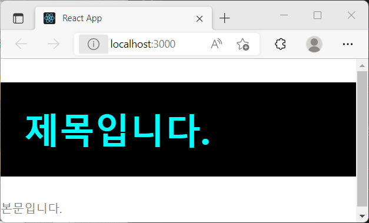
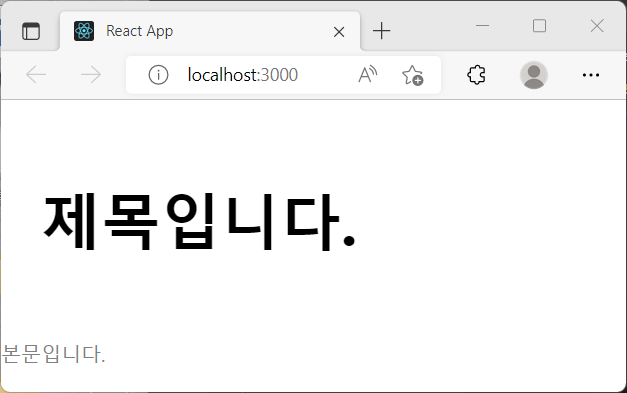

# CSS Module

CSS Module은 CSS를 불러와 사용할 때 클래스 이름을 <b>고유값으로 만들어</b> 컴포넌트의 스타일 className이 중복되지 않도록 해줍니다. 따라서 CSS Module을 사용하면 클래스 이름의 고유성에 대해 고민할 필요가 없습니다!

<br>

## 1. CSS Module 사용법

CSS Module을 사용하기 위해서는 CSS 파일을 ".module.css" 확장자로 저장하고(CSS Module 자동 적용), 그 CSS 스타일을 사용할 js/jsx 컴포넌트 파일에서 불러와주면 됩니다.

```
/*test.module.css*/

/*다른 컴포넌트에서 사용했던 이름을 써도 됩니다*/
.title {
    background: black;
    padding: 2rem;
    font-size: 3rem;
    color: aqua;
}

/*모든 className="description"에 전역적으로 지정하고 싶을 때 사용합니다.*/
:global .description{
    color: gray;
}
```

className에 다른 컴포넌트의 className과 같은 이름을 써도, CSS Module을 import한 컴포넌트에만 적용되기 때문에 편리하게 사용할 수 있습니다. CSS Module을 적용할 컴포넌트에서 사용법은 아래와 같습니다.

```
//CSSModule을 import
import styles from './test.module.css';

// return하는 jsx 내부에 적용해주기
<div className={styles.title}></div>
```

컴포넌트를 만들어 test.module.css를 적용해봅니다.

```
//CssModuleTest.js
import styles from "./test.module.css";

const CSSModuleTest = () => {
  return (
    <div>
      <h1 className={styles.title}>제목입니다.</h1>
      <p className="description">본문입니다.</p>
    </div>
  );
};

export default CSSModuleTest;
```



잘 보면 className을 import해온 style로 지정합니다. 알아서 고유성을 유지하기 위해 CSSModule은 className을 뭐라고 지정했을까요? console.log(styles)로 알아보니 콘솔에 'title: "test_title\_\_1+qS9"'가 출력되었습니다. 이처럼 CSS Module은 자동으로 클래스 이름을 <b>'파일이름\_클래스이름\_\_해시값'</b>으로 지정해주기 때문에 클래스 이름이 같아도 중복되지 않습니다.

<br>

## 2. 클래스 이름이 두 개 이상일 때

클래스 이름을 두 개 이상 적용할 때에도 CSS Module을 적용할 수 있습니다. 이때는 백틱(``)을 활용한 템플릿 리터럴을 사용해줍니다.

```
<div className={`${styles.class1} ${styles.class2}`}>
```

test.module.css, CssModuleTest.js 파일에 새로운 클래스를 추가해보겠습니다.

```
/* test.module.css */
...
.inverted {
  color: black;
  background: white;
}
...

//CssModuleTest.js
...
<h1 className=`${styles.title} ${styles.inverted}`>제목입니다.</h1>
...
```



<br>

## 3. 일반 CSS 파일에서 적용하기

":global"을 이용하여 전역적으로 CSS를 적용했던 것처럼, ":local"을 사용해 CSS Module을 적용할 수 있습니다.

```
:local .title {

}
```

<br>

## Reference

- Create React App(Adding a CSS Modules Stylesheet) : https://create-react-app.dev/docs/adding-a-css-modules-stylesheet/
- 리액트를 다루는 기술, 김민준
