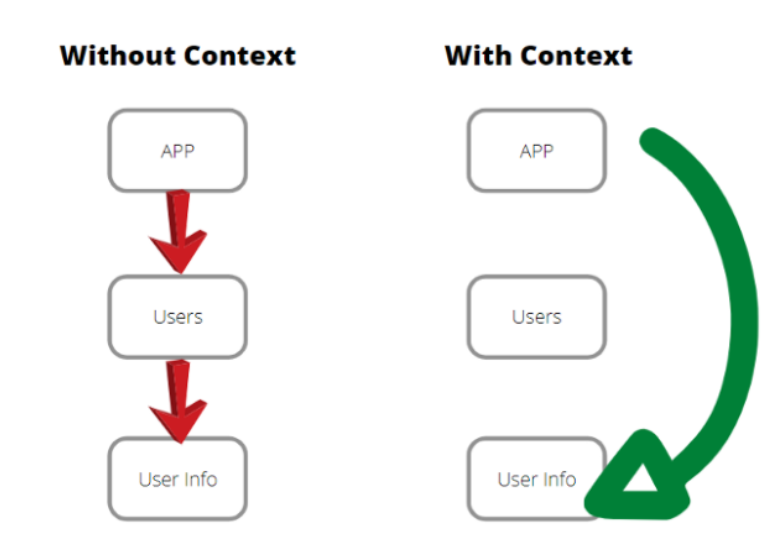
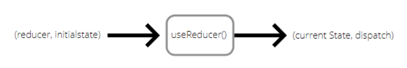

# Context와 useReducer를 이용해 컴포넌트 트리 전체에 데이터 제공하기

props는 부모 컴포넌트가 자식 컴포넌트에게 데이터를 전해줄 때 사용합니다.

```
//App.js
return <MyComponent name="React">

//MyComponent.js
const MyComponent = ({ name }) => {
    return <div>Hello, {name}!</div>
}
```

편리한 기능이지만 만약 여러 컴포넌트에 이 값을 전달해야 한다면 번거로운 작업이 될 것입니다. 또한 props는 부모->자식, 즉 하향식으로 데이터를 전달하는 데에 사용됩니다.
Context는 컴포넌트의 구조와 상관 없이 여러 컴포넌트가 값을 공유할 수 있게 해줍니다.



위 과정에 따르면 App에서 User Info에 값을 전달하기 위해서는, App에서 User Info의 부모인 Users에 먼저 props를 통해 값을 전달하고, 이후에 Users에서 User Info에 props로 값을 전달합니다. 반면 Context의 경우에는 App 컴포넌트에 Provider(Context API의 일부입니다. 앞으로 알아볼 겁니다!)를 씌워주기만 하면 props를 이용하지 않고도 App의 모든 하위 컴포넌트에 전역적으로 값을 전달할 수 있습니다.

useReducer는 useState보다 더 다양한 state를 action과 함께 관리할 수 있는 Hook입니다.



문법이나 사용법 등 자세한 내용은 [이곳(TIL/useReducer)](https://github.com/hoijoii/TIL/blob/main/React/Hooks_useReducer.md)에 정리했습니다.

이번 TIL에서는 Context API와 useReducer를 함께 사용하여 전역적으로 상태관리를 해봅니다.

<br>

## 1. 문법

#### 1-1. Context 만들기

```
import { createContext } from "react";

const UserStateContext = createContext(null);
```

Context가 만들어집니다. 초깃값은 null입니다. 물론 string, number 등 모든 자료형의 값이 초깃값이 될 수 있습니다.

#### 1-2. Provider와 Consumer

```
//Provider
<UserStateContext.Provider value={/*Context의 값이 이 값으로 바뀝니다*/}>
    {children}
</UserStateContext.Provider>
```

Provider는 Context의 값을 변경하고 전달하는 역할을 합니다. value에 새로운 값을 지정하면 Context의 값이 value값으로 바뀌고, Provider가 context를 consume하고 있는 모든 컴포넌트에게 값의 변화를 알립니다.

{children}은 하위 컴포넌트를 의미합니다. Provider는 하위 컴포넌트를 둬야 합니다. 예를 들어 {children}의 자리에 \<App />을 둔다면 App에게 Context값을 전달할 수 있습니다.

다음은 Context값을 사용하기 위한 Consumer입니다.

```
//Consumer
<UserStateContext.Consumer>
    {value => (
        <div>
            <h1>출력값: {value}</h1>
        </div>
        )
    }
</UserStateContext.Consumer>

//Consumer 대신 useContext를 사용할 수 있습니다.
import { useContext } from "react";

    //component 내부
    userIdContext = useContext(UserStateContext)

    return (
        <div>
            <h1>출력값: {userIdContext}</h1>
        </div>
    )
```

Consumer를 사용하여 Context 안에 들어있는 값을 조회할 수 있습니다. Render Props 방식으로 작성하여야 합니다.

> Render Props: 컴포넌트의 children이 있어야 할 자리에 JSX 혹은 함수를 전달하는 것

<br>

## 2. 로그인 사용자 정보 전역적으로 관리, 전달하기

이제 본격적으로 Context와 useReducer를 사용하여 로그인 후 사용자 정보를 다른 컴포넌트에 전달해봅니다.

- context 폴더를 만들고 그 안에 userContext.js 파일을 만듭니다.
- Login Page에서 username을 전달받아 context에 저장하고 Home에서 context 내부 값을 사용합니다.
- 이 TIL과 관련 없이, 백엔드를 사용합니다. 로그인은 JWT를 사용하여 이루어지며 이 TIL은 사용자 정보를 유지하는 내용만 포함합니다.

#### 2-1. userContext.js

- useContext를 사용합니다. Consumer보다 더 간편하게 Context를 사용할 수 있습니다.
- useReducer의 state와 dispatch 둘 다 전역적으로 관리하겠습니다. state는 username, dispatch로는 LOGIN과 LOGOUT 두 가지 action이 있습니다. 하위 컴포넌트에서 어떤 action을 취하느냐에 따라 전역적으로 state가 바뀔 것입니다.
- state, dispatch 두 가지의 관리를 위해서는 context도 두 가지가 필요합니다.
- useContext를 컴포넌트마다 일일이 선언하지 않고 userContext.js 안에서 Hook을 만들어 사용하겠습니다.

```
import { createContext, useContext } from "react";

//Context 생성
export const UserStateContext = createContext(null);
export const UserDispatchContext = createContext(null);

//새로운 Hook 생성
export const useUserState = () => {
  const state = useContext(UserStateContext);
  return state;
};

export const useUserDispatch = () => {
  const dispatch = useContext(UserDispatchContext);
  return dispatch;
};
```

state와 dispatch를 관리할 context들을 만들어줍니다. 초깃값은 null입니다. state context와 dispatch context를 consume할 수 있는 Hook도 만들어주었습니다.

이번엔 Provider 함수를 만들어줍니다. useReducer를 이 안에서 사용할 것이기 때문에 일단 작성해주겠습니다. state와 dispatch를 관리할 것이므로 각각의 Provider value에 state, dispatch를 작성합니다.

```
export const UserProvider = ({ children }) => {
  const [state, dispatch] = useReducer(reducer, initState);

  return (
    <UserStateContext.Provider value={state}>
      <UserDispatchContext.Provider value={dispatch}>
        {children}
      </UserDispatchContext.Provider>
    </UserStateContext.Provider>
  );
};
```

하위 컴포넌트들에 여러 context를 consume하게 하고 싶다면 위처럼 Provider를 중첩하면 됩니다.

이제 useReducer를 작성해봅니다.

```
//useReducer 추가
import { createContext, useContext, useReducer } from "react";

const initState = {
  user: "",
};

const reducer = (state, action) => {
  switch (action.type) {
    case "LOGIN":
      return {
        user: action.user,
      };
    case "LOGOUT":
      return {
        user: "",
      };
    default:
      return state;
  }
};

```

하위 컴포넌트에서 로그인 action을 취하면 사용자 정보를 Context에 적용시키고, 로그아웃 action을 취하면 값을 없앱니다.

userContext.js 작성이 끝났습니다. 전체 코드입니다.

```
import { createContext, useContext, useReducer } from "react";

const initState = {
  user: "",
};

const reducer = (state, action) => {
  switch (action.type) {
    case "LOGIN":
      return {
        user: action.user,
      };
    case "LOGOUT":
      return {
        user: "",
      };
    default:
      return state;
  }
};

export const UserStateContext = createContext(null);
export const UserDispatchContext = createContext(null);

export const UserProvider = ({ children }) => {
  const [state, dispatch] = useReducer(reducer, initState);

  return (
    <UserStateContext.Provider value={state}>
      <UserDispatchContext.Provider value={dispatch}>
        {children}
      </UserDispatchContext.Provider>
    </UserStateContext.Provider>
  );
};

export const useUserState = () => {
  const state = useContext(UserStateContext);
  return state;
};

export const useUserDispatch = () => {
  const dispatch = useContext(UserDispatchContext);
  return dispatch;
};
```

#### 2-2. LoginPage.js

```
import { useState, useEffect } from "react";
import { useCookies } from "react-cookie";
import { useNavigate } from "react-router-dom";
import LoginService from "../LoginService";
import { useUserState, useUserDispatch } from "../contexts/userContext";

const LoginPage = () => {
  const [token, setToken] = useCookies(["mytoken"]);
  const [users, setUsers] = useState([]);
  const [isLogin, setLogin] = useState(true);
  const [username, setUsername] = useState("");
  const [password, setPassword] = useState("");

  const dispatch = useUserDispatch();

  const navigate = useNavigate();

  useEffect(() => {
    axios
      .get(`http://127.0.0.1:8000/account/users/`, {
        headers: {
          Authorization: `Token ${token["mytoken"]}`,
        },
      })
      .then((resp) => setUsers(resp.data))
      .catch((Error) => {
        console.log(Error);
      });
  }, []);

  const loginBtn = () => {
    LoginService.LoginUser({ username, password })
      .then((resp) => setToken("mytoken", resp.token))
      .catch((error) => console.log(error));
  };

  const RegisterBtn = () => {
    LoginService.RegisterUser({ email, password, realname, companyCode })
      .then(() => loginBtn)
      .catch((error) => console.log(error));
  };

  const searchId = () => {
    users.map((user) => {
      if (user.email === username) {
        localStorage.setItem("userId", user.id);
      }
    });
  };

  useEffect(() => {
    if (token["mytoken"]) {
      localStorage.setItem("username", username);
      searchId();
      navigate("/home");

      dispatch({
        type: "LOGIN",
        user: username,
      });
    }
  }, [token]);

  return (
    <div>
      <div className="Loginform">
        {isLogin ? <h1>File Collection Project</h1> : <h1> Register </h1>}
        {isLogin ? (
          <div>
            <div className="textForm mb-3">
              <input
                type="text"
                className="form-control"
                id="username"
                placeholder="Enter Email"
                value={username}
                onChange={(e) => setUsername(e.target.value)}
              />
              <br />
              <input
                type="password"
                className="form-control"
                id="password"
                placeholder="Enter Password"
                value={password}
                onChange={(e) => setPassword(e.target.value)}
              />
              <br />
              <br />
              <Button
                block
                color="secondary"
                size="lg"
                type="button"
                onClick={loginBtn}
                className="loginbutton"
              >
                로그인
              </Button>
            </div>
          </div>
        ) : (
          <div>
            <div className="textForm mb-3">
              <input
                type="email"
                className="form-control"
                id="email"
                placeholder="Enter Email"
                value={email}
                onChange={(e) => setEmail(e.target.value)}
              />
              <br />
              <input
                type="password"
                className="form-control"
                id="password"
                placeholder="Enter Password"
                value={password}
                onChange={(e) => setPassword(e.target.value)}
              />
              <br />
              <input
                type="text"
                className="form-control"
                id="realname"
                placeholder="Enter Your Realname"
                value={realname}
                onChange={(e) => setRealname(e.target.value)}
              />
              <br />
              <input
                type="text"
                className="form-control"
                id="companyCode"
                placeholder="Enter Your Company Code"
                value={companyCode}
                onChange={(e) => setCompanyCode(e.target.value)}
              />

              <br />
              <br />
              <Button
                block
                color="secondary"
                size="lg"
                type="button"
                onClick={RegisterBtn}
                className="loginbutton"
              >
                회원가입
              </Button>
            </div>
          </div>
        )}
      </div>

      <div className="mb-3">
        <br />
        {isLogin ? (
          <h6>
            계정이 없으신가요?{" "}
            <Button
              color="default"
              size="sm"
              type="button"
              className="smButton"
              onClick={() => setLogin(false)}
            >
              회원가입
            </Button>{" "}
            해주세요!
          </h6>
        ) : (
          <h6>
            계정이 있으신가요?{" "}
            <Button
              color="default"
              size="sm"
              type="button"
              className="smButton"
              onClick={() => setLogin(true)}
            >
              로그인
            </Button>{" "}
            해주세요!
          </h6>
        )}
      </div>
    </div>
  );
};

export default LoginPage;

```

<br>

## 3. 특이사항

Context는 props처럼 값을 전달하려는 용도로 사용하면 좋습니다. 하위 컴포넌트 뿐만이 아닌 다른 컴포넌트에 전달할 때에요!

당연하게도, Context는 영속적으로 값을 보관할 수 없습니다. Context API를 처음 접하고 했던 실수는 Context를 이용하여 로그인 후 사용자 정보를 계속적으로 유지하려고 했던 것입니다.
첫 번째로 실행되는 컴포넌트에서 값을 Context에 담은 후 다음에 실행될 컴포넌트에서 useContext를 통해 불러올 수 있지만 새로고침하면 사라져버립니다.(사실 위 항목들에서 사용한 코드가 제가 실수했던 코드입니다.. 하지만 값은 잘 전달되었습니다. 다음에는 Redux를 사용해보고 싶습니다.)

사용자 정보를 보관하여 계속해서 유지하려면 [localStorage 혹은 sessionStorage](https://github.com/hoijoii/TIL/blob/main/JavaScript/localVSsession.md)를 사용하는 것이 좋습니다.

<br>

## Reference

- React: https://ko.reactjs.org/docs/context.html
- https://javascript.plainenglish.io/how-to-manage-state-with-usereducer-and-context-api-3f0ea40a3ac3
- 리액트를 다루는 기술, 김민준
