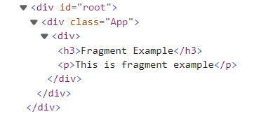
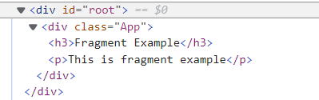

# Fragments

Fragments를 이용해 별도의 노드를 추가하지 않고 여러 자식 노드를 그룹화할 수 있습니다.

대다수의 프로젝트에서 render() 혹은 함수기반 컴포넌트 return값에, 사용하지 않는 \<div>\</div>가 있는 것을 볼 수 있죠.

```
//클래스 기반 컴포넌트
class FragmentExample1 extends Component{
  render(){
    return(
      <div> //사용되지 않는 <div>
        <h3>Fragment Example</h3>
        <p>This is fragment example</p>
      </div>
)}
}

//함수 기반 컴포넌트
function FragmentExample2() {
  return (
    <div> //사용되지 않는 <div />
      <h3>Fragment Example</h3>
      <p>This is fragment example</p>
    </div>
  )
}
```

\<div>가 사용되지는 않지만 쓰는 이유는, 컴포넌트가 여러 요소를 return할 때 하나의 요소로 묶어서(그룹화) return해야 하기 때문입니다.

- 하나로 묶어주는 요소 = 부모
- 하위에 묶이는 요소 = 자식

그런데 Fragments를 사용하면 별도의 부모노드를 추가하지 않아도 되므로, \<div>를 사용하지 않아도 됩니다.

<br>

## 1. Fragment 문법

```
//기본 문법
<React.Fragment>
  {/*
  html요소
  */}
</React.Fragment>


//단축 문법
<>
  {/*
  html요소
  */}
</>
```

단축 문법이 훨씬 간단하지만 attributes, key를 쓰고 싶다면 \<React.Fragment>를 사용해야 합니다.

```
function FragmentExample2() {
  return (
    <div>
      <h3>Fragment Example</h3>
      <p>This is fragment example</p>
    </div>
  )
}
```

콘솔에서 root component를 확인하면 \<div>\</div>가 그대로 출력됩니다.



이번엔 Fragment를 사용해봅니다.

```
function MyFragment() {
  return (
    <React.Fragment>
      <h3>Fragment Example</h3>
      <p>This is fragment example</p>
    </React.Fragment>
  )
}
```



자식요소들이 부모요소 없이 존재합니다. 덕분에 html 코드가 두 줄이나 단축되었습니다.

  <br>

## 2. Fragments를 사용하는 이유

- 의미 없는 div를 없앰으로써 코드를 간결하게 만들 수 있다. 물론 메모리를 적게 사용할 수 있다.
- 특별한 부모자식 관계를 가진 요소 사이에 div가 추가되면 css 레이아웃 유지가 어렵다. Fragment를 사용함으로써 해결할 수 있다.

<br>

## Reference

- React(Fragments) : https://ko.reactjs.org/docs/fragments.html
