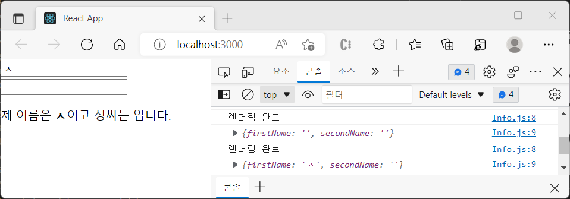
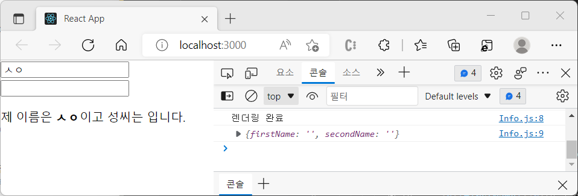
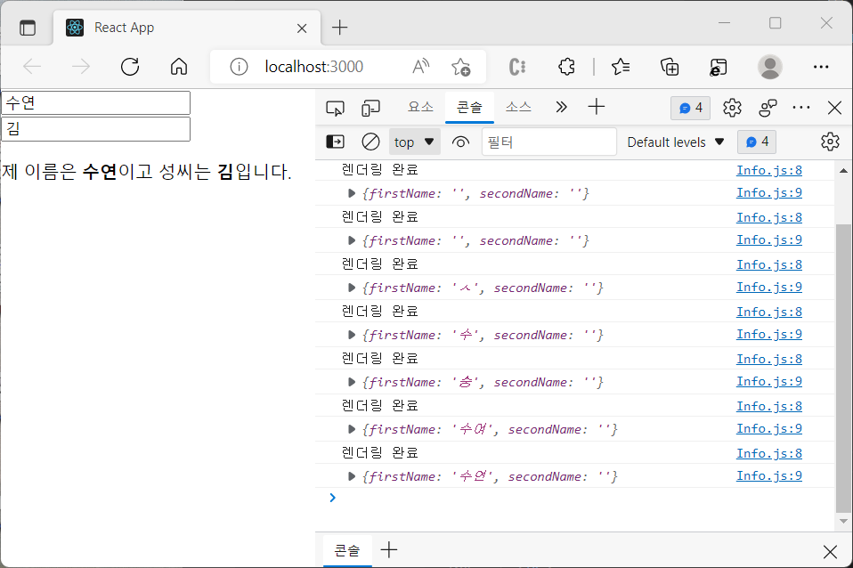
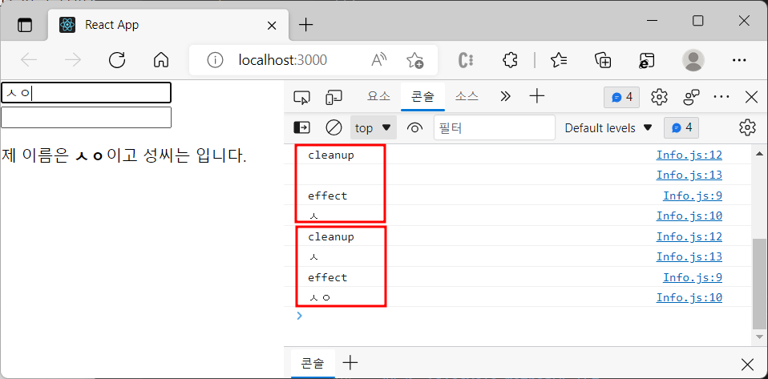

# Effect Hook

컴포넌트가 <b>렌더링할 때</b>마다 특정 작업을 수행하도록 설정하는 Hook입니다. 클래스형 컴포넌트의 메소드인 componentDidMount와 componentDidUpdate를 합친 형태로 볼 수 있습니다.

## 1. useEffect

useEffect는 함수 컴포넌트 내부에서 불러낼 수 있는데, 특별한 API가 없이 effect를 통해 state 변수나 props에 접근할 수 있습니다. effect는 모든 렌더링 이후에 매번 발생하고 필요에 따라 발생하는 시점을 수정 가능합니다.

```
useEffect( () => { ... } )
```

useEffect() 의 인자로 화살표함수를 넣어 사용할 수 있습니다.

이전에 작성한 [State Hook](https://github.com/hoijoii/TIL/blob/main/React/Hooks_useState.md)문서의 예시 코드 중 '텍스트를 입력해 화면에 나타내는 예제'에 useEffect를 적용해봅니다.

```
import { useState, useEffect } from "react";

const Info = () => {
  const [firstName, setFirstName] = useState("");
  const [secondName, setSecondName] = useState("");
  useEffect(() => {
    console.log("렌더링 완료");
    console.log({ firstName, secondName });
  });

  const onChangeFirstName = (e) => {
    setFirstName(e.target.value);
  };

  const onChangeSecondName = (e) => {
    setSecondName(e.target.value);
  };

  return (
    <div>
      <input value={firstName} onChange={onChangeFirstName} />
      <input value={secondName} onChange={onChangeSecondName} />
      <p>
        제 이름은 <b>{firstName}</b>이고 성씨는 <b>{secondName}</b>입니다.
      </p>
    </div>
  );
};

export default Info;

```



첫 번째 렌더링 후 리렌더링 될 때에도 실행됩니다.

<br>

## 2. useEffect의 사용

useEffect의 특성을 활용하여 특정 용도로 사용해보겠습니다.

#### 2-1. 마운트될 때만 실행

첫 렌더링 때에만 실행하고 업데이트 될 때는 실행하고 싶지 않을 수 있습니다. 이때에는 useEffect 함수의 두 번째 파라미터로 <b>빈 배열</b>을 넣어주면 됩니다!

```
//Info.js
...

  useEffect( ()=> {
    console.log('마운트할 때만 실행하기')
  }, [] );

...
```



첫 렌더링 때에만 실행되었습니다.

#### 2-2. 특정 값이 업데이트 될 때만 실행

useEffect의 두 번째 파라미터인 배열 안에 특정 값을 넣어주면 됩니다.

```
//Info.js
...
  useEffect( ()=> {
    console.log('업데이트할 때만 실행하기')
  }, [firstName] );
...
```



firstName을 검사하여 업데이트 되었다면 콘솔에 출력합니다. secondName은 검사하지 않으므로 업데이트되어도 출력되지 않습니다.

#### 2-3. 뒷정리 함수

컴포넌트가 언마운트 되기 전, 업데이트되기 직전에 어떠한 작업을 수행하려고 할 수 있습니다. 이때는 useEffect 함수에서 뒷정리(cleanup) 함수를 반환해주면 됩니다.

```
//Info.js
...

  useEffect(() => {
    // 렌더링하면 실행
    console.log("effect");
    console.log(firstName);

    // cleanup 함수 리턴
    // 업데이트 직전 실행
    return () => {
      console.log("cleanup");
      console.log(firstName);
    };
  }, [firstName]);

...
```



input 창에 텍스트를 입력할 때마다 빨간 네모 박스처럼 cleanup, effect가 같이 출력됩니다. cleanup은 업데이트 '직전'에, effect는 렌더링 후에 실행되기 때문에 담고 있는 firstName 값도 다릅니다.
제가 input 창에 'ㅇ'를 입력한다면 콘솔창에는 cleanup과 ㅅㅇ, effect와 ㅅㅇㅇ이 출력될 것입니다.

언마운트될 때마다 뒷정리 함수를 호출하고 싶다면, useEffect 함수의 첫 번째 파라미터에 뒷정리 함수를 리턴하고 두 번째 파라미터에는 비어있는 배열을 넣어줍니다.

```
   useEffect(() => {
    console.log("effect");
    return () => {
      console.log("cleanup");
    };
  }, []);

```

  <br>

## Reference

- React(Hooks) : https://ko.reactjs.org/docs/hooks-intro.html
- React(Hooks-effect) : https://ko.reactjs.org/docs/hooks-state.html
- 리액트를 다루는 기술, 김민준
