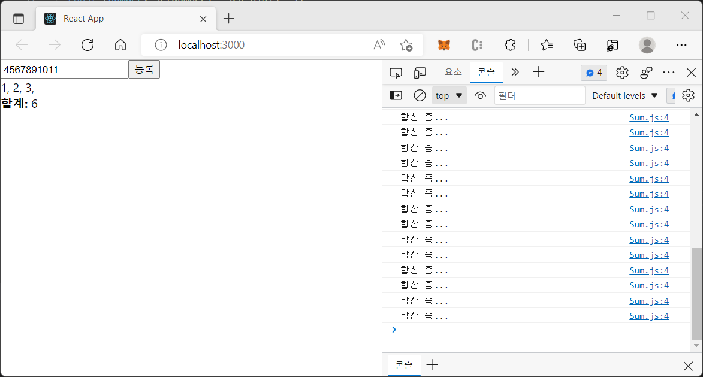
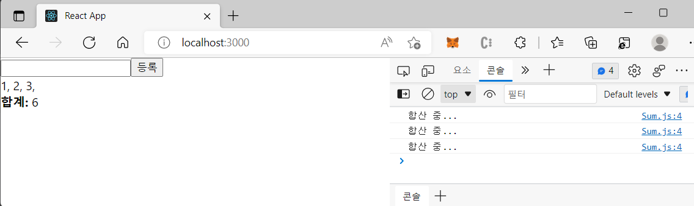

# 렌더링 성능 최적화: useMemo, useCallback

useMemo와 useCallback을 사용하면 함수 컴포넌트의 작업을 최적화할 수 있습니다. 두 hook에 대해 알아보고 비교해보겠습니다.

## 1. useMemo

useMemo는 함수 컴포넌트 내부 연산을 최적화합니다.(=memoization된 값 반환)

> Memoization: 동일한 계산을 반복해야 할 때, 이전에 계산한 값을 메모리에 저장함으로써 동일한 계산의 반복 수행을 제거하여 프로그램 실행 속도를 빠르게 하는 기술을 말합니다.

```
const memoizedValue = useMemo(()=>ComputeFunction(a, b), [a, b])
```

- ComputeFunction(a, b) : 최적화하고 싶은 함수
- [a, b] : 렌더링 과정에서 이 값이 변했을 때만 연산 실행 (함수의 매개변수를 담는 것이 일반적). 값은 꼭 배열에 넣어야 합니다! 만약 값이 바뀌지 않았다면 이전에 연산했던 결과를 다시 사용합니다.

배열을 두 번째 인자에 넣지 않는 경우, 렌더링 때마다 새 값을 계산합니다.

#### Input을 받아 합계 구하기 + useMemo()로 연산 최적화

합계를 구하는 함수(이하 getSum)를 만들고 컴포넌트의 return값인 jsx에 "합계 : {getSum}"를 작성했더니, 매 렌더링마다 getSum이 실행되었습니다. Input 하나 입력에도 리렌더링이 되기 때문에 당연히 getSum도 실행되어 콘솔을 꽉 메웠죠.


하지만 useMemo()를 사용하면 원하는 값이 바뀔 때 (사진의 '등록'버튼을 누를 때)만 getSum을 실행시킬 수 있습니다.

```
import { useState, useMemo } from "react";

const getSum = (numbers) => {
  console.log("합산 중...");
  if (numbers.length === 0) return 0;
  const sum = numbers.reduce((a, b) => a + b);
  return sum;
};

const Sum = () => {
  const [arr, setArr] = useState([]);
  const [number, setNumber] = useState("");

  const onChange = (e) => {
    setNumber(e.target.value);
  };

  const onInsert = (e) => {
    const nextArr = arr.concat(parseInt(number));
    setArr(nextArr);
    setNumber("");
  };

  const sum = useMemo(() => getSum(arr), [arr]);

  return (
    <div>
      <input value={number} onChange={onChange} />
      <button onClick={onInsert}>등록</button>
      <div>
        {arr.map((value, index) => (
          <span key={index}>{value}, </span>
        ))}
      </div>
      <div>
        <b>합계:</b> {sum}
      </div>
    </div>
  );
};

export default Sum;

```



'합산 중...' 메세지의 수가 확연히 줄었습니다.
getSum 대신 sum를 jsx에 넣어 arr이 바뀔 때만 연산을 실행하기 때문입니다.

<br>

## 2. useCallback

useCallback은 주로 렌더링 성능을 최적화해야 할 때 사용합니다. useMemo가 'memoization된 값'을 반환한다면, useCallback은 'memoization된 콜백함수'를 반환합니다. 만들어놨던 함수를 재사용한다는 것인데, 1번에서 본 코드 일부를 보겠습니다.

```
  const onChange = (e) => {
    setNumber(e.target.value);
  };

  const onInsert = (e) => {
    const nextArr = arr.concat(parseInt(number));
    setArr(nextArr);
    setNumber("");
  };
```

위 두 함수는 컴포넌트 리렌더링마다 새로 만들어진 함수를 사용합니다. 만약 컴포넌트 렌더링이 자주 발생 혹은 렌더링할 컴포넌트가 많아지면 성능 면에서 좋지는 않기 때문에 useCallback으로 최적화해줄 수 있습니다.

```
const memoizedCallback = useCallback(
  () => {
    doSomething(a, b);
  },
  [a, b], //a, b가 바뀌었을 때 함수 생성
);
```

- 첫 번째 파라미터에 최적화하고 싶은 함수를 화살표함수 형태로 작성합니다.
- 두 번째 파라미터에는 배열을 넣습니다. 이 배열 내부의 값이 바뀔 때만 함수가 새로 생성됩니다.

#### Input을 받아 합계 구하기 + useMemo(), useCallback()으로 연산 최적화

useCallback()으로 onChange와 onInsert에만 변화를 주었습니다.

```
import { useState, useMemo, useCallback } from "react";

...

  //컴포넌트가 처음 렌더링될 때에만 함수를 만듦
  const onChange = useCallback((e) => {
    setNumber(e.target.value);
  }, []);

  //number나 list가 바뀌었을 때만 함수를 만듦
  const onInsert = useCallback(
    (e) => {
      const nextArr = arr.concat(parseInt(number));
      setArr(nextArr);
      setNumber("");
    },
    [number, arr]
  );
...
```

onChange의 두번째 파라미터에 비어있는 배열이 있는데, 이때는 처음 렌더링할 때만 함수를 생성하고 이후에는 이 함수를 재사용합니다. onInsert의 두번째 파라미터 배열에 number, arr이 있는데, 이 둘 중 하나라도 바뀌면 함수가 새로 생성되어 실행됩니다.

그렇다면 언제 함수를 재사용하고 특정값 갱신시 새로 생성하도록 해야 할까요?

기존의 값이 함수 안에 포함될 경우 그 값을 배열에 넣어주어야 합니다.
onChange같은 경우 number, arr의 기존 값에 의존성이 없고 state를 바꾸기만 하니 처음에만 생성하고 재사용해도 문제가 없습니다. 그런데 onInsert에서는 number와 arr의 기존 값을 조회한 후 nextArr을 생성해야 하기 때문에 함수를 새로 만둘어 주는 것이 좋습니다.

<br>

## Reference

- React(Hooks) : https://ko.reactjs.org/docs/hooks-intro.html
- React(useMemo, useCallback) : https://ko.reactjs.org/docs/hooks-reference.html#usememo
- 리액트를 다루는 기술, 김민준
