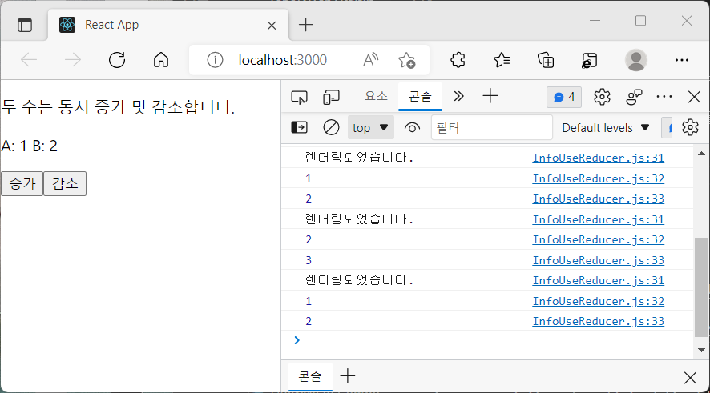

# useReducer

useState보다 더 다양한 상태를 다른 값으로 업데이트하고 싶을 때 사용합니다.

## 1. 형태

useReducer의 인자:

- state : 현재 상태
- action : 업데이트 위해 필요한 정보를 담은 값

Reducer 함수에서 새로운 상태를 만들 때에는 반드시 <b>불변성</b>을 지켜주어야 합니다!

```
// 컴포넌트 외부에 작성
// Reducer 함수
function reducer(state, action) {
  return { ... };
}

// action
{
  type: 'INCREMENT',
  //등..
}
```

리덕스와 달리 type은 필수가 아니며 객체가 아니라 문자열, 숫자여도 상관 없습니다.

```
//컴포넌트 내부
  const [state, dispatch] = useReducer(reducer, {value: 0});
```

- state: 현재 가리키고 있는 상태.
- dispatch: 액션을 발생시키는 함수. dispatch(action)과 같다.

useReducer의 첫 번째 파라미터에는 컴포넌트 밖의 reducer 함수를, 두 번째 파라미터에는 해당 reducer의 기본값을 넣어줍니다.

useReducer의 장점은 <b>컴포넌트를 업데이트하는 함수를 컴포넌트 바깥에 빼낸다</b>는 점입니다.

이해를 돕기 위해 실습했던 코드를 정리해봅니다.

<br>

## 2. useReducer의 사용

위에서 설명했듯 다양한 작업을 위해 action의 type을 사용할 수 있고, 혹은 useState를 여러 번 사용하는 대신 useReducer로 여러 개의 input 상태를 관리할 수도 있습니다. 아래는 그 예시들입니다.

#### 2-1. action.type 지정

아래는 useReducer로 구현한 카운터 실습 코드입니다.

```
//Counter.js
import { useReducer } from "react";

function reducer(state, action) {
  switch (action.type) {
    case "INCREMENT":
      return { value: state.value + 1 };
    case "DECREMENT":
      return { value: state.value - 1 };
    default:
    // 아무것도 해당되지 않을 때 기존 상태를 반환
      return state;
  }
}

const Counter = () => {
  const [state, dispatch] = useReducer(reducer, { value: 0 });
  return (
    <div>
      <p>현재 카운터 값은 {state.value} 입니다.</p>
      <button onClick={() => dispatch({ type: "INCREMENT" })}>+1</button>
      <button onClick={() => dispatch({ type: "DECREMENT" })}>-1</button>
    </div>
  );
};

export default Counter;
```

reducer 함수 안에 action.type을 지정하여, 컴포넌트 안에서 필요한 작업에 맞는 case를 골라 dispatch를 호출합니다.

#### 2-2. 여러 Input의 상태관리

input이 여러 개일 때 useState를 여러 번 쓰고 그만큼 렌더링해야만 상태관리가 가능했는데요, useReducer를 사용하면 한 번에 많은 input의 상태관리를 할 수 있습니다.

```
function reducer(state, action) {
  return{
    ...state,
    [action.name]: action.value
  };
}

const Info = () => {
  const [state, dispatch] = useReducer(reducer, {
    firstName: '',
    secondName: ''
  });
  const { firstName, secondName } = state;
  const onChange = e => { dispatch(e.target) };

  return(
    <div>
      <input name="firstName" value={firstName} onChange={onChange} />
      <input name="secondName" value={secondName} onChange={onChange} />

      <div>이름: {firstName}</div>
      <div>성씨: {secondName}</div>
    </div>
  )
}
```

useReducer의 action은 무엇이든 될 수 있습니다. 위 코드에서는 이벤트 객체가 지닌 e.target을 action 값으로 사용합니다.

<br>

#### 2-3. 렌더링 횟수 관찰하기

useState로 하나의 state를 업데이트 시킬 경우 한 번의 렌더링이 이루어집니다. 두 개의 state를 업데이트하면 두 번의 렌더링이 이루어질 것입니다. 그렇다면 useReducer를 이용해 한 번에 여러 값의 state를 업데이트시키는 경우는 어떨까요?

가장 유명한 counter 예시 코드를 조금 변형하여 알아보았습니다.

아래는 reducer 함수입니다.

```
function reducer(state, action) {
  switch (action.type) {
    case "INCREMENT":
      return {
        ...state,
        valA: state.valA + 1,
        valB: state.valB + 1,
      };
    case "DECREMENT":
      return {
        ...state,
        valA: state.valA - 1,
        valB: state.valB - 1,
      };
    default:
      return state;
  }
}
```

valA와 valB 두 변수를 한 번에 업데이트하려고 합니다.
INCREMENT는 두 수를 한 번에 증가시키고, DECREMENT는 한 번에 감소시킵니다.

```
const Example = () => {
  const [state, dispatch] = useReducer(reducer, {
    valA: 0,
    valB: 1,
  });
  const { valA, valB } = state;

  //렌더링마다 실행합니다.
  useEffect(() => {
    console.log("렌더링되었습니다.");
    console.log(valA);
    console.log(valB);
  });

  return (
    <div>
      <p>두 수는 동시 증가 및 감소합니다.</p>
      <p>
        A: {valA} B: {valB}
      </p>
      <button onClick={() => dispatch({ type: "INCREMENT" })}>증가</button>
      <button onClick={() => dispatch({ type: "DECREMENT" })}>감소</button>
    </div>
  );
};

export default Example;
```

useEffect를 통해 렌더링될 때마다 콘솔에 valA와 B를 출력하도록 하였습니다.
counter 예제와 거의 동일하게 버튼을 통해 valA와 valB를 증감합니다.



두 개의 값이 바뀌지만 렌더링은 한 번만 이루어집니다.
따라서 useReducer를 사용하면 렌더링 횟수를 줄일 수 있기 때문에 useState에 비해 성능이 좋습니다.

  <br>

## Reference

- React(Hooks) : https://ko.reactjs.org/docs/hooks-intro.html
- React(Hooks-effect) : https://ko.reactjs.org/docs/hooks-reference.html#usereducer
- 리액트를 다루는 기술, 김민준
