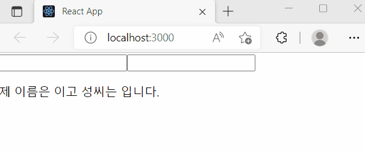
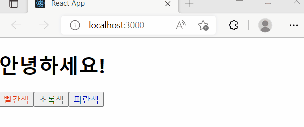

# State Hook

useState는 가장 기본적인 Hook이며, 상태관리를 위해 사용됩니다. 함수 컴포넌트 안에서 state를 사용할 수 있게 해주며, 클래스형 컴포넌트의 this.state가 제공하는 기능과 같습니다.

## 1. useState의 사용법

```
//name는 예시이며 상태의 이름을 마음대로 정할 수 있습니다.
const [name, setName] = useState('')
```

첫 번째 요소는 '현재의 값(상태)', 두 번째 요소는 '값(상태)을 바꾸어주는 함수'(=setter 함수)입니다. setter 함수에 파라미터를 넣어 호출하면 전달받은 파라미터로 값이 바뀌며 컴포넌트가 리렌더링됩니다.(state가 바뀌었기 때문)

useState 함수의 인자에는 값(상태)의 초깃값을 넣어줍니다.
클래스형 컴포넌트에서는 state의 초깃값이 객체여야 하지만, 함수 컴포넌트에서는 숫자, 문자열, 객체... 무엇이든 상관 없습니다.

<br>

## 2. useState 사용 예시

이해를 돕기 위해 예제를 정리해봅니다.

#### 텍스트를 입력해(input태그 사용) 화면에 나타내는 예제

```
//Info.js
import { useState } from "react";

const Info = () => {
  const [firstName, setFirstName] = useState("");
  const [secondName, setSecondName] = useState("");

  const onChangeFirstName = (e) => {
    setFirstName(e.target.value);
  };

  const onChangeSecondName = (e) => {
    setSecondName(e.target.value);
  };

  return (
    <div>
      <input value={firstName} onChange={onChangeFirstName} />
      <input value={secondName} onChange={onChangeSecondName} />
      <p>
        제 이름은 <b>{firstName}</b>이고 성씨는 <b>{secondName}</b>입니다.
      </p>
    </div>
  );
};

export default Info;
```


setter 함수인 setFirstName과 setSecondName에 담기는 값이 곧바로 해당 상태에 반영됩니다.

#### 버튼을 누르면 글씨의 색상이 바뀌는 예제

```
//Say.js
import { useState } from "react";

const Say = () => {
  const [color, setColor] = useState("black");

  return (
    <div>
      <h1 style={{ color }}>안녕하세요!</h1>
      <button style={{ color: "red" }} onClick={() => setColor("red")}>
        빨간색
      </button>
      <button style={{ color: "green" }} onClick={() => setColor("green")}>
        초록색
      </button>
      <button style={{ color: "blue" }} onClick={() => setColor("blue")}>
        파란색
      </button>
    </div>
  );
};

export default Say;
```



h1 태그의 style에는 useState의 인자인 'black'이 초깃값으로 설정되어 있습니다. 이때 버튼을 누르면 color가 setColor로 인해 바뀌며 h1에 적용되는 색상 또한 바뀝니다.

<br>

## 3. this.state와의 비교

#### 3-1. state 불러오기

```
// 클래스형 컴포넌트
<p>this is {this.state.name}<p>

// 함수 컴포넌트
<p>this is {name}</p>
```

클래스형 컴포넌트는 name을 불러오기 위해 this.state.name을 사용하지만 함수 컴포넌트는 name을 직접 불러와 사용합니다.

#### 3-2. state 갱신하기

- 클래스형 컴포넌트: this.setState() 호출

```
  <button onClick={() => this.setState({ count: this.state.count + 1 })}>
    +1
  </button>
```

- 함수형 컴포넌트: 상태를 변경시키는 setter 함수 사용

```
  <button onClick={() => setCount(count + 1)}>
    +1
  </button>
```

## Reference

- React(Hooks) : https://ko.reactjs.org/docs/hooks-intro.html
- React(Hooks-state) : https://ko.reactjs.org/docs/hooks-state.html
- 리액트를 다루는 기술, 김민준
