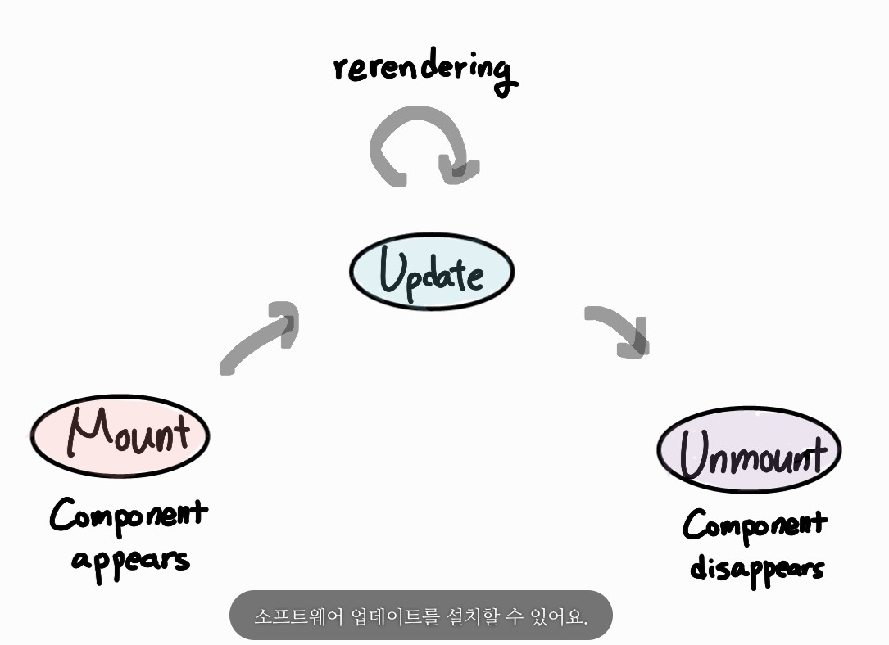
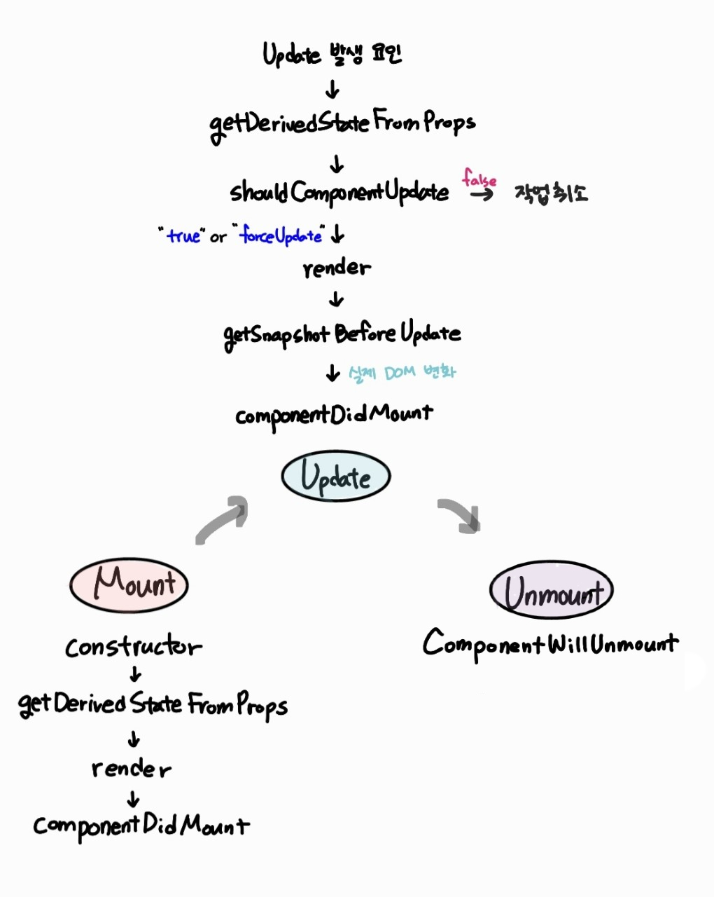
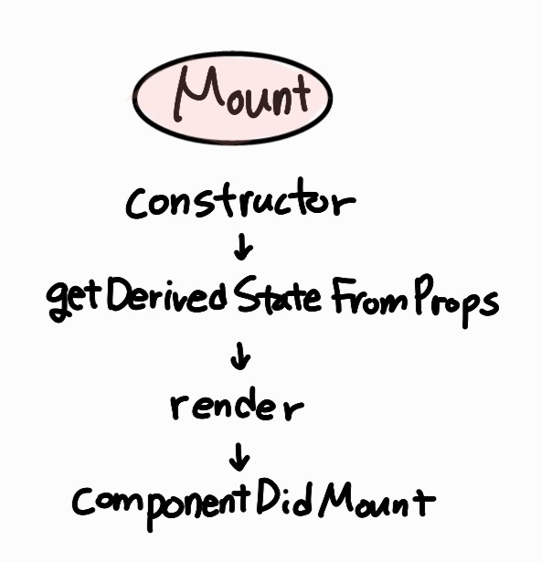
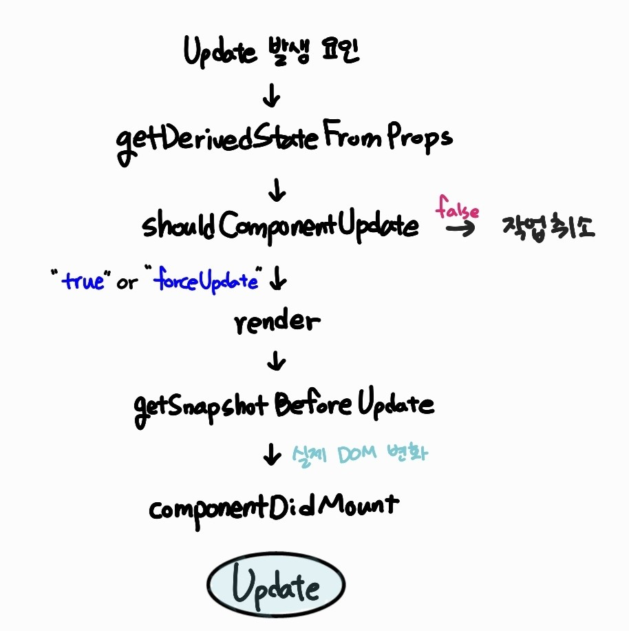
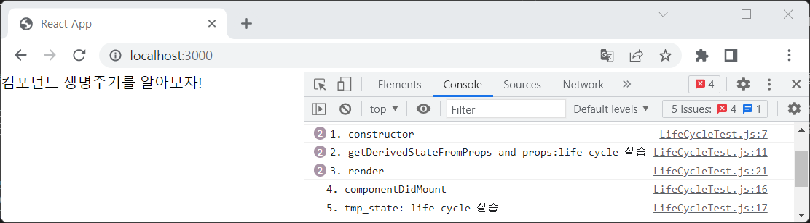
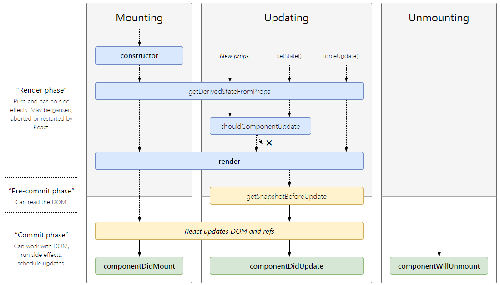

# Life cycle of Component

React에서의 생명주기(Life cycle) : component의 생성, 변경, 소멸 과정

컴포넌트의 수명은 페이지가 렌더링을 준비하는 때부터 페이지에서 사라질 때까지 존재합니다.



컴포넌트를 렌더링할 때 어떤 작업을 처리하거나, 업데이트 전후로 어떤 작업을 처리해야 할 수도 있는데 이때 라이프사이클 메소드를 사용합니다. 라이프사이클 메소드는 클래스형 컴포넌트에서만 사용할 수 있습니다. (함수 컴포넌트에서는 Hooks를 이용하여 비슷한 처리 가능)

<br>

## 1. Life cycle Method의 종류



총 9개의 메소드가 있으며 Mount, Update, Unmount로 나눌 수 있습니다. Will 접두사가 있는 메소드는 어떤 작업을 시작하기 '전'에 실행되고, Did 접두사가 있는 메소드는 어떤 작업을 시작한 '후'에 실행됩니다.

#### 1-1. Mount(마운트)

DOM이 생성되고 웹 브라우저에 나타나는 것을 말합니다. 이때 호출되는 메소드와 순서는 아래와 같습니다!



- constructor : 클래스 생성자. 처음 한 번만 실행되며 state 선언, props를 초기화할 때 사용.
- getDerivedStateFromProps : 컴포넌트가 새로운 props를 받게 됐을 때 state를 변경.
- componentDidMount : 컴포넌트가 웹브라우저에 나타난 후 호출. 화면이 모두 그려진 후에 실행되어야 하는 이벤트 처리, 초기화, 비동기 작업 처리 등 가장 많이 활용됨.

#### 1-2. Update(업데이트)

컴포넌트 업데이트를 발생시키는 요인은 네 가지가 있습니다.

- props가 바뀜 : 부모 컴포넌트에서 넘겨주는 props의 값이 바뀔 때 렌더링이 일어남
- state가 바뀜 : setState에 의해 업데이트
- 부모 컴포넌트 리렌더링 : 부모 컴포넌트 리렌더링 -> 자식 컴포넌트 리렌더링
- this.forceUpdate로 인한 렌더링 트리거

컴포넌트에 업데이트가 이뤄질 경우 아래 메서드가 호출됩니다.



- getDerivedStateFromProps : 업데이트 시작 전 호출. props 변화에 따라 state 변화도 주고 싶을 때 사용. (mount에서도 호출)
- shouldComponentUpdate : 리렌더링을 할지 말지 결정하는 메소드. boolean 유형의 데이터를 세팅하며 true 반환 시 render 호출, false 반환 시 작업 중지. (forceUpdate가 호출되면 생략)
  이 메소드를 따로 생성하지 않으면 언제나 true값이 반환된다.
- render : 컴포넌트 리렌더링
- getSnapshotBeforeUpdate : 변화를 DOM에 반영하기 직전에 호출
- componentDidUpdate : 업데이트 작업 후 호출

#### 1-2. Unmount(언마운트)

mount의 반대 과정으로 컴포넌트를 DOM에서 제거합니다.


- componentWillUnmount : 컴포넌트가 웹브라우저에서 사라지기 전 호출

  <br>

## 2. Lifecycle method의 사용

라이프사이클 메소드를 하나씩 살펴보며, 예제를 만들어 이해해봅니다.

#### 2-1. constructor

컴포넌트를 만들 때 가장 처음으로 실행되며 state 선언과 props 초기화를 위해 사용합니다.

```
constructor(props) { ... }
```

#### 2-2. getDerivedStateFromProps

React v16.3 이후 만들어진 메소드. 컴포넌트 마운트, 업데이트 시 호출됩니다. 컴포넌트가 새로운 props를 받으면 state를 변경해줍니다.

```
  static getDerivedStateFromProps(nextProps, prevState) {
    // props로 받아온 값을 동기화시키는 용도.
    if (nextProps.color !== prevState.color) {
      return { color: nextProps.color };
    }
    return null; // state를 변경할 필요가 없을 때 null 반환
  }
```

#### 2-3. render

return되는 html형식의 코드를 화면에 그려주는, 모양새를 정의하는 메소드입니다. 화면 내용이 변경되어야 할 시점에 자동으로 호출되며 Life cycle 중 유일하게 *필수*입니다!

```
render() { ... }
```

#### 2-4. componentDidMount

첫 렌더링을 마치고 실행됩니다. 라이브러리, 프레임워크의 함수 호출, 이벤트 등록, 네트워크 요청 등 비동기 작업 처리를 할 수 있습니다.

```
componentDidMount() { ... }
```

<br>

여기까지가 첫 렌더링 과정이며, 아래 예시 코드를 만들어 실행해봅니다.

```
import React, { Component } from "react";
//LifeCycleTest.js
export class LifeCycleTest extends Component {
  constructor(props) {
    super(props);
    this.state = {};
    console.log("1. constructor");
  }

  static getDerivedStateFromProps(props, state) {
    console.log("2. getDerivedStateFromProps and props:" + props.prop_value);
    return { tmp_state: props.prop_value };
  }

  componentDidMount() {
    console.log("4. componentDidMount");
    console.log("5. tmp_state: " + this.state.tmp_state);
  }

  render() {
    console.log("3. render");
    return <div>컴포넌트 생명주기를 알아보자!</div>;
  }
}

export default LifeCycleTest;
```



#### 2-5. shouldComponentUpdate

props 혹은 state를 변경했을 때 리렌더링을 시작할지 여부를 결정합니다. boolean값(true, false)을 반환하고, 따로 메서드를 생성하지 않으면 true값이 기본적으로 반환됩니다. false값 반환 시 업데이트 과정이 중지됩니다. (성능 최적화 위해 리렌더링 방지 시 false값 반환하게 함)

```
shouldComponentUpdate(nextProps, nextState) { ... }
```

- 현재 props, state 값 -> this.props와 this.state로 접근
- 새로 설정될 props, state 값 -> nextProps, nextState로 접근

#### 2-6. getSnapshotBeforeUpdate

React v16.3 이후 만들어진 메소드. 렌더링된 결과가 실제 반영되기 직전에 호출됩니다. 업데이트하기 직전 값을 참고할 때 활용되며, return값은 후에 componentDidUpdate에서 snapshot 값으로 전달합니다.
아래는 스크롤바 위치에 대한 예시입니다.

```
getSnapshotBeforeUpdate(prevProps, prevState) {
    if(prevState.array !== this.state.array) {
        const { scrollTop, scrollHeight } = this.list
        return { scrollTop, scrollHeight } //snapshot
    }
}
```

#### 2-7. componentDidUpdate

리렌더링 완료 후 실행됩니다.

```
componentDidUpdate(prevProps, prevState, snapshot) { ... }
```

- prevProps, prevState : 컴포넌트가 이전에 가졌던 데이터에 접근 가능
- snapshot : getSnapshotBeforeUpdate의 리턴값

<br>

#### 2-8. componentWillUnmount

컴포넌트를 DOM에서 제거하라 때 실행합니다. componentDidMount에서 등록한 이벤트 등이 있다면 제거작업을 해야 합니다!

```
componentWillUnmount() { ... }
```

#### 2-9. componentDidCatch

React v16에 만들어진 메소드. 렌더링 도중 에러 발생 시 먹통이 되지 않게 하고 오류 UI를 보여줍니다.

```
componentDidCatch(error, info) {
    this.setState({
        error: true
    });
    console.log({ error, info });
}
```

- error : 파라미터에 어떤 에러가 발생했는지
- info : 어디의 코드에서 에러가 발생했는지

주의할 점: this.props.children으로 전달되는 컴포넌트에서 발생한 에러만 잡아낼 수 있습니다.

<br>

## 3. Life cycle diagram



<br>

## Reference

- React 공식 문서: https://ko.reactjs.org/docs/react-component.html
- https://projects.wojtekmaj.pl/react-lifecycle-methods-diagram/
- 리액트를 다루는 기술, 김민준
- 초보자를 위한 리액트 200제, 이정열
