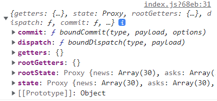

# Vuex

vuex는 vue에서 사용하는 상태관리 라이브러리이다.
리액트에서 redux를 사용하듯이, vuex를 사용하면 store에 저장된 데이터를 전역적으로 모든 컴포넌트에서 사용할 수 있다. vuex는 view와 state 간 독립성을 유지하는 규칙을 고수하는데, 덕분에 코드의 유지보수성이 좋아질 수밖에 없다. 단순한 앱을 만들 때에는 굳이 vuex를 적용할 필요가 없겠지만 중대형 SPA를 구현할 경우 권장된다.

이러한 사실과 더불어 vuex를 사용하는 이유는 다음과 같다.
- 중앙 집중화된 상태정보 관리
- 상태정보가 변경되는 상황과 시간을 추적
- 컴포넌트에서 상태정보에 안전하게 접근

store객체에서 모든 데이터(state)를 관리하고 컴포넌트의 트리구조에 상관없이 state에 접근할 수 있으므로 중앙 집중화되었다고 할 수 있다. 여기서 저장소는 반응적이기 때문에 상태변경 시 반응적이고 효율적으로 업데이트된다.

또 state 변경을 '커밋'함으로써 state를 변경시키는 mutation handler 함수에서 devtool에 mutation log를 남긴다. 따라서 상태정보 관리에 대한 추적이 가능해지는 것이다.


## 1. vuex의 구조

아래는 vue의 단방향 데이터흐름을 나타낸 그림이다. vuex 가이드 페이지에서 가져왔다.


- state : vuex에 저장하는 데이터. 상태.
- action : 사용자가 일으키는 이벤트로, 상태를 변경시키기 위한 작업. 주로 비동기처리 메소드를 포함한다.
- mutation : action의 결과를 받아 상태를 설정한다. 추적이 가능해서 devtool을 이용해 상태 변경 내역을 확인할 수 있다.

컴포넌트에서 dispatch 메소드를 이용해 action을 일으킨다. 
action의 결과는 커밋되고(기록하기 위함), mutate를 통해 변경사항이 실제 state에 반영된다. 여기서 action의 결과는 상태의 변경사항이다.

그런데..! 사실 <strong>컴포넌트에서 바로 commit하는 것도 허용</strong>한다고 한다. 즉 state를 변경하는 mutation을 action 없이 바로 이용할 수 있다. 단, <u>비동기작업을 할 필요도 없고 그저 단순한 상태조작인 경우에 한정해서다.</u>이때는 action을 거치는 것이 더 복잡해서인 듯 하다. 물론 action을 통해 커밋하는 것을 권장하기는 한다.

이 state, action, mutation은 store객체를 이용해 관리할 수 있다. 

<br>

## 2. store


vue 프로젝트의 src 경로에 있는 store 파일을 보자.

```
// 버전: vue3, vuex4

import { createStore } from 'vuex'

export default createStore({
  state: {
  },
  getters: {
  },
  mutations: {
  },
  actions: {
  },
  modules: {
  }
})
```
state, mutations, actions는 <a href="#sma">위에서</a> 알아봤다. getters와 modules는 무엇일까?

- getters : state에 있는 값을 계산하는 함수를 모든 컴포넌트에서 프로퍼티 혹은 메소드처럼 사용할 수 있도록 한다.
- modules : store가 방대해지는 경우에 모듈 단위로 store를 쪼개어 사용한다.

#### 2-1. state

store에 담겨 전역적으로 사용될 데이터가 state에 들어있다.

```
// store/index.js
...
  state: {
    a: [],
    b: "",
    c: 0
  },
...
```

객체 형식으로 데이터 초기값을 담는다.
state에 담긴 값을 component에서 사용하려면 아래처럼 하면 된다.

```
// views/Homeview.vue

<template>
  ...
  <div v-for="item in this.$store.state.a">{{ item }}</div>
  <div>{{ this.$store.state.b }}</div>
  <!-- c도 b와 같이 불러옴 -->
  ...
</template>
...
```


#### 2-2. action

모든 비동기 작업은 action에서 한다. 그리고 그 작업의 결과값은 mutation으로 넘어간다.
즉, backend api에서 받아온 값을 mutation으로 넘겨주면 된다. 이 일은 context와 commit 메소드가 한다.

```
// store/index.js
...
  mutations: {
    mutation이름(state, data){
      //지금은 신경쓰지 마세요
      ...
    }
  },
  actions: {
    비동기작업할함수(context) {
      api메소드().then((resp) => {
        // 'mutation이름'이라는 mutation에 resp.data라는 데이터를 넘겨줌
        context.commit('mutation이름', resp.data)
      }) //.catch(...) 등 체이닝
    }
  },
...
```

action 안에 있는 함수는 무조건 context를 인자로 가지며, mutation을 일으키기 위해 commit이 필요하다.
여기서 '비동기작업할함수'는 보통 대문자로 작성한다. (ex: GET_DATA, ADD_DIALOG 처럼)
이렇게 만들어져 있는 action의 메소드를 사용하기 위해서 컴포넌트에 dispatch를 써보자.

```
<script>
...
export default {
  ...
  created() {
    this.$store.dispatch("비동기작업할함수"); // 따옴표 꼭 쓰기
  },
  ...
};
</script>
```

물론 꼭 created() 안에 사용해야 하는 건 아니다. 그냥 action의 함수를 컴포넌트 생성 시에만 한 번 불러오기 위해서 이렇게 작성했다. 
action의 동작을 다시 한 번 정리하자면,
- 컴포넌트에서 dispatch를 통해 action 속 비동기함수 호출
- action 속 함수는 비동기작업 후 그 결과를 context.commit을 통해 mutation으로 넘겨줌

이라고 할 수 있겠다.

#### 참고 : context

action 핸들러가 가지고 있는 객체. 


context를 이용해 commit, dispatch, getter 등의 메소드를 사용할 수 있다. 

#### 참고2 : action에서 context를 사용하지 않고도 commit 가능
```
actions: {
  비동기작업할함수({ commit }) { 
    ...
    commit('mutation이름', resp.data)
    ...
  }
}
```


#### 2-3. mutation

mutation은 

```
// store/index.js
...
  mutations: {
    mutation이름(state, data){
      //지금은 신경쓰지 마세요
      ...
    }
  },
  actions: {
    비동기작업할함수(context) {
      api메소드().then((resp) => {
        // 'mutation이름'이라는 mutation에 resp.data라는 데이터를 넘겨줌
        context.commit('mutation이름', resp.data)
      }) //.catch(...) 등 체이닝
    }
  },
...
```

<br>

<br>

## Reference

- 코딩애플 : https://www.youtube.com/watch?v=0BbF7UxKKvg&t=139s
- Vue : https://kr.vuejs.org/v2/guide/syntax.html
