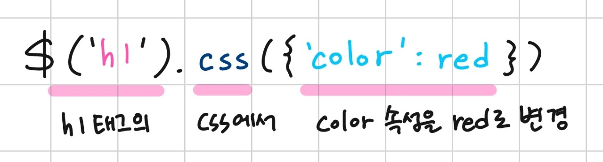
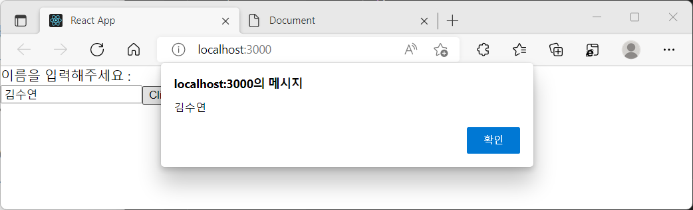

# jQuery

jQuery는 가장 인기있는 JS 라이브러리입니다. 이벤트 처리와 애니메이션 등을 간단하고 빠르게 구현합니다.
jQuery는 HTML 문서의 요소를 "찾고 선택하여" 조작합니다.

```
//예시
//모든 <div>의 배경 색을 ##FF0000;으로 만들기
$("div")css({'background': '#FF0000'});
```

:heavy_check_mark: 학습내용:

- jQuery의 장점
- jQuery 사용하기
  - 요소 선택해서 css 적용하기
  - DOMContentLoaded를 jQuery로 작성하기
- React에서 jQuery 사용하기

<br>

## 1. 장점

write less, do more가 쉬워집니다.

- 간결한 문법
- 다른 라이브러리와의 충돌이 없다
- 다양한 플러그인
- 브라우저 호환성 문제 해결

<br>

## 2. \<script>에서 jQuery 사용하기

#### 2-1. Installation

- jquery.com에서 스크립트 파일 다운로드 및 링크하기

```
<!-- 순서 매우 중요. jQuery를 먼저 불러와서 사용할 스크립트를 작성해야 합니다. head에 넣는 것 추천 -->
<script src="jQuery.js"></script>
<script>
// 작성할 jQuery
</script>
```

- CDN으로 사용하기 - jQuery CDN: https://releases.jquery.com/ 에서 확인

#### 2-2. 사용 방법

JS에서는 태그 선택을 위해서 document.getElementsByTagName('태그') 코드를 사용해야 합니다. 하지만 jQuery를 사용하면 selector를 이용해 JS보다 훨씬 쉽게 태그를 선택할 수 있습니다.

> selector: HTML 문서 안의 요소를 찾는 방법 (태그, 아이디, 클래스 등)

:heavy_check_mark: jQuery에서 selector 이용해 선택하기

- 태그 : $("a")
- 아이디 : $("#container")
- 클래스 : $(".btn")

#### css 변경하기

이번엔 직접 사용해보겠습니다. 아래는 jQuery를 이용해 h1태그의 글씨 색상을 빨간색으로 변경하는 코드입니다.

```
<script>
  $('h1').css({'color':'red'});
  //document.getElementsByTagName('h1')[0].style.color='red'; 와 같은 의미
</script>
```



script 태그 안에 사용한 코드는 위 의미와 같습니다. 한 눈에 봐도 코드 길이가 아주 짧아졌습니다.

#### DOMContentLoaded로 \<head>에 jQuery 사용하기

위에서 사용한 css 코드는 적용할 태그 아래에서 실행되어야 합니다. 그렇지 않으면 아직 태그가 실행되지 않았기 때문에 jQuery는 태그를 찾을 수 없습니다. \<h1>이 body 안에 있다면 적어도 \<body> 안의 \<h1> 아래에 jQuery를 써야 css가 적용되겠죠.

```
<script>
  <h1>Hello, jQuery!</h1>
</script>

<script>
  $('h1').css({'color':'red'});
</script>
```

하지만 head에 일반 css를 작성했던 것처럼, head에 jQuery로 작성한 css를 빼줄 수 있습니다. head에서 body에 접근하기 위해서, JS에서는[DOMContentLoaded](https://github.com/hoijoii/TIL/blob/main/JavaScript/DOMContentLoaded.md)를 쓰면 되겠지요? jQuery로 더 간단하게 사용할 수 있습니다.

```
<script>
    $(document).ready(()=>{
        $('h1').css({'color' : 'red'});
    })

    /*
    document.addEventListener('DOMContentLoaded', ()=>{
      $('h1').css({'color' : 'red'});
    })
    */
</script>
```

> $(document).ready(()=>{})

document 요소를 선택하고 준비되면(ready) 콜백을 실행하라는 뜻으로, body 안의 문서가 전부 로드되면 실행됩니다.
더 간략하게 작성할 수도 있습니다.

```
<script>
    $(()=>{
        $('h1').css({'color' : 'red'});
    })
</script>
```

> $(()=>{})

위와 같은 형태로 head 안에서 jQuery를 사용할 수 있습니다.

물론 코드가 길어진다면 css 파일을 불러오듯 다른 js 파일에 jQuery를 작성하고 head에 script src로 불러와 사용할 수 있지요!

```
<!-- index.html -->
<!-- CDN을 html파일에 둬도 js파일의 jQuery가 실행됩니다 -->
<head>
  ...
  <script src="./main.js"></script>
  ...
</head>

<!-- main.js -->
$(() => {
  $("h1").css({ color: "red" });
});
```

<br>

## 3. React에서 jQuery 사용하기

html 문서가 아닌 React에서도 jQuery의 사용이 가능합니다.

#### 3-1. Installation

> npm install jquery <br>
> yarn add jquery

#### 3-2. 사용 방법

React에서 jQuery를 사용하기 위해 우선 $를 import합니다.

```
import $ from 'jquery'
```

#### id 선택하여 input 값을 가져오기

index.html 예제에서는 태그를 선택했지만 이번엔 id를 선택하겠습니다.

```
//jQuery
//.val()은 input과 같은 양식 요소의 값을 가져옵니다. () 안에 값을 넣으면 양식 필드의 값을 설정합니다.
const inputVal = $("#inputId").val();

//jsx
<input id="inputId" name="inputName" />
```

jQuery에서 input의 id인 inputId를 선택했으므로, .val()에 의해 input에 담기는 텍스트는 inputVal이 될 것입니다.
아래는 텍스트를 입력받아 알림창을 띄우는 간단한 코드입니다. 버튼을 누르면 AlertName 함수가 실행됩니다.

```
//Jquery.js
import $ from "jquery";

const Jquery = () => {
  const AlertName = (e) => {
    // id가 inputId인 input 요소에 접근하여 값을 가져옵니다.
    const inputVal = $("#inputId").val();
    alert(inputVal); //알림창을 띄웁니다.
  };
  return (
    <div>
      <div>이름을 입력해주세요 : </div>
      <input id="inputId" name="inputName" />
      <button onClick={(e) => AlertName(e)}>Click Me!</button>
    </div>
  );
};

export default Jquery;
```



<br>

## Reference

- Rock's Easyweb(css 메서드) : https://www.youtube.com/watch?v=uwn3Y4xzOcw&list=PL-qMANrofLyu4HcK14ntl-o7d-eHxo7-U&index=1
- yarn(jquery) : https://yarnpkg.com/package/jquery
- jQuery(.val) : https://api.jquery.com/val/#val2
- 초보자를 위한 리액트 200제, 이정열
